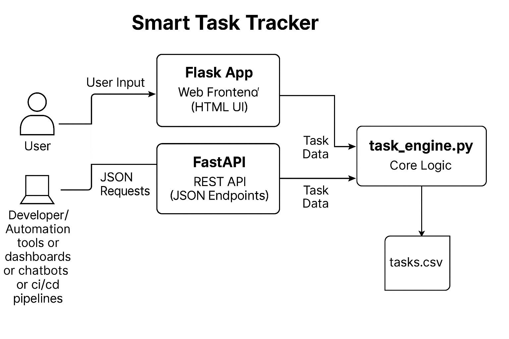

# Build & Learn Python – Smart Task Tracker

Welcome to the **Build & Learn Python** project!  
In this project, we’ll build a complete application called the **Smart Task Tracker** — step-by-step across four interactive sessions.

The goal is to **learn Python by building a real-world project**, evolving from command-line to web and API-based app development.

---

## 🔧 What Are We Building?

We’re building a **Smart Task Tracker** — an application that lets users:
- Add tasks
- List tasks
- Mark tasks as complete
- Delete tasks

We’ll use:
- Python for the core logic
- CSV files for data persistence
- Flask for creating a Web UI
- FastAPI for building a REST API

---

## 🧠 Project Architecture



- Users can interact with the app through a web UI (Flask) or send JSON requests (FastAPI).
- Both Flask and FastAPI call a common logic module `task_engine.py`.
- This core logic reads and writes to `tasks.csv` — our data store.

---

## 🗂 Project Structure

```
build-and-learn-python/
│
├── session-1/         # Python basics + CLI app foundation
├── session-2/         # CSV-based task engine (core logic)
├── session-3/         # Flask web UI integration
├── session-4/         # FastAPI REST API service
└── README.md          # You are here!
```

---

## 📚 Session-wise Breakdown

### ✅ Session 1 – Python Basics & CLI App
Learn core Python concepts like variables, loops, functions, dictionaries, lists, and file I/O.  
We build a simple **command-line app** to add and list tasks.

📁 Refer folder: `session-1/`

---

### ✅ Session 2 – Core Engine with CSV Persistence
We introduce `csv` module and build the **main task engine** that reads and writes tasks to a file (`tasks.csv`).  
We also build CLI support for adding, listing, completing, and deleting tasks.

📁 Refer folder: `session-2/`

---

### ✅ Session 3 – Web UI using Flask
We convert the CLI app into a **web app** using Flask.  
Users can now interact through HTML forms to manage tasks.

📁 Refer folder: `session-3/`

---

### ✅ Session 4 – REST API using FastAPI
We expose our app as a **RESTful API** using FastAPI — supporting automation, integration with dashboards, scripts, bots, and more.

📁 Refer folder: `session-4/`

---

## 🚀 Learning Outcome

By the end of this project, you’ll be able to:
- Understand Python fundamentals with hands-on experience
- Build and scale a real-world application step by step
- Use both Flask and FastAPI in a single project
- Reuse core business logic across multiple interfaces

---

Happy building! 🧑‍💻
